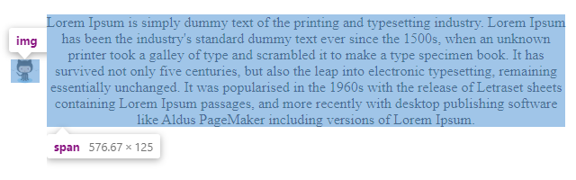

## Requirements

- img is vertical center based on span
- img always keep 8px margin from span
- span always keep text-align center
- img with span always keep horizontal center

## Online Example

https://robberfree.github.io/frontend-problem/img-with-text

## Question

Is it possible to complete the task by using CSS only?

## ScreenShoot

